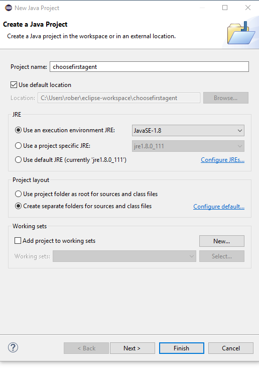

# Overview

The Mancala Boardgame Engine is split into several projects for it to be as extensible as possible:

* engine: Project containing the main mancala engine. It handles the User Interface, game logic and loading of new agents. 
* mctsagent: Project containing an agent playing by Monte Carlo Treesearch.
* alphabetaagent: Project containing an agent playing by Alpha Beta Pruning.
* randomagent: Project containing an agent playing completely random.

## How to play

Mancala is a turn based board game family that is played typically by two players sitting in front of each other. Each player tries to get as many beans as possible into his own depot (Kalaha).

There are many different rules of Mancala. This engine currently implements the Kalaha rule set. The rules are described [here](http://www.wikihow.com/Play-Kalaha). 

## What is an Agent?

What is an agent? An agent is basically some class implementing the doTurn() method and returning an action the engine should play for the particular agent in the current turn. The engine itself implements a HumanAgent where the human decides what turn to play, but there are several other types of agents (mctsagent, alphabetaagent, randomagent and maybe your new agent) that will be able to play the game.

Loading new agents can be done at runtime, so no recompilation is needed. You just have to create a .JAR file containing the agent class, load the jar with the full class name (including package) and voila the engine is able to play with your new agent. Please read the documentation for more details.

## How to create a new Agent?

We will develop an agent that will always return the most left selectable slot on the board. You do not have to use the steps described here. 

The gist of this tutorial is basically: Add the jar files of the "libs" folder in this repository as a dependency, create an agent implementing the *MancalaAgent* interface, select the main class as *at.pwd.boardgame.Main* and add the full classname as a command line argument. To load the agent in any instance export it as a normal JAR file.

The following instructions have been tested with Eclipse (Oxygen) or IntelliJ IDEA (2017.5) on Windows 10 64bit, other configurations should work too.

### Using IntelliJ

First check out the GitHub repository on your local machine.


We create a new Java project using Gradle and Java 1.8 (please install proper JDK if missing). We press Next.


The GroupId should be a unique identifier, which is usually the same as your package name. For example, I chose at.pwd.choosefirstagent and choosefirstagent for the ArtifactId. The version does not need to be changed. We press Next.


Gradle JVM should be set to Java 1.8 and the checkbox "Create directories for empty content roots automatically" should be checked. We press Next.


Choose a Project name and a Project location. I will keep it at the default. We press Finish, if you are prompted with the message, that the directory does not exist, press OK.

We need to add some JAR libraries as a dependency to the project. For this please copy the /lib folder of the repository into the root folder of your new project. This folder contains the dependencies (including the Mancala Boardgame Engine).

Gradle needs to know about these dependencies. In the dependencies scope of the build.gradle file add
```
compile files('lib/mancala-engine.jar', 'lib/lib/simple-xml-2.7.jar', 'lib/lib/stax-1.2.0.jar', 'lib/lib/stax-api-1.0.1.jar', 'lib/lib/xpp3-1.1.3.3.jar')
```
now import the changes and build the project. This may take a few seconds.


The build.gradle file should look something like this
```
group 'at.pwd.choosefirstagent'
version '1.0-SNAPSHOT'

apply plugin: 'java'

sourceCompatibility = 1.8

repositories {
    mavenCentral()
}
dependencies {
    compile files('lib/mancala-engine.jar', 'lib/lib/simple-xml-2.7.jar', 'lib/lib/stax-1.2.0.jar', 'lib/lib/stax-api-1.0.1.jar', 'lib/lib/xpp3-1.1.3.3.jar')
    testCompile group: 'junit', name: 'junit', version: '4.12'
}
```

Create a new Java package in the src/main folder, by right clicking on the folder in the Project tree. I will name the package *at.pwd.choosefirstagent*. Create a new class in the newly created package that will contain the agent. The name I choose is ChooseFirstAgent. This class should implement the MancalaAgent interface, the doTurn method and a toString method. It should look something like the following:
```
package at.pwd.choosefirstagent;

import at.pwd.boardgame.game.mancala.MancalaGame;
import at.pwd.boardgame.game.mancala.agent.MancalaAgent;
import at.pwd.boardgame.game.mancala.agent.MancalaAgentAction;

public class ChooseFirstAgent implements MancalaAgent {
    @Override
    public MancalaAgentAction doTurn(int i, MancalaGame mancalaGame) {
        return null;
    }
    @Override
    public String toString() {
    	return "";
    }
}
```

The class needs some logic. We will simply get a list of the currently selectable slots by mancalaGame.getSelectableSlots() and use the first slotId in this list as a move. We need to pack this slot id in a MancalaAgentAction instance. Additionally we need to implement a toString method returning the name of this agent. For a more detailed description of the API please have a look at the [JavaDoc](https://metzzo.github.io/mancala/index.html) of [MancalaGame](https://metzzo.github.io/mancala/at/pwd/boardgame/game/mancala/MancalaGame.html).

```
package at.pwd.choosefirstagent;

import at.pwd.boardgame.game.mancala.MancalaGame;
import at.pwd.boardgame.game.mancala.agent.MancalaAgent;
import at.pwd.boardgame.game.mancala.agent.MancalaAgentAction;

import java.util.List;

public class ChooseFirstAgent implements MancalaAgent {
    @Override
    public MancalaAgentAction doTurn(int computationTime, MancalaGame mancalaGame) {
        // get a list of all currently selectable slots
        List<String> slots = mancalaGame.getSelectableSlots();
        // since this list will never be empty (otherwise the game would be over), we dont need a additional check
        // Slot IDs are unique strings strings
        String selectedSlot = slots.get(0);
        // now we pack the selected slot in an agent action and return it
        // the Mancala Boardgame Engine will then apply this action onto the slot
        return new MancalaAgentAction(selectedSlot);
    }
	
    @Override
    public String toString() {
        return "Choose First Agent";
    }
}
```


To test the new agent we need a new build configuration. Select in the menu Run/Run... and then Edit Configurations. Press on the "+" symbol and select Application. The main class should be *at.pwd.boardgame.Main* - which should be listed if you imported the jar files properly.
The Program arguments should be the full classname (including the package), in this case at.pwd.choosefirstagent.ChooseFirstAgent this is necessary for the engine to load the agent. The "Use classpath of module" box should be "choosefirstagent_main".

Press Okay and now run the application using the newly created build configuration. The Choose First Agent should be selectable as an agent and play as intended.


To allow other people to import the agent into the engine, without compiling it, we need to export the agent as a JAR file. To do so, we need to create a new build configuration. So select Edit Configurations. Press the "+" symbol again. This time select "Gradle". The selected gradle project should be "choosefirstagent" and the Task should be "jar". After running the gradle task the jar should be placed in the build/libs folder named "choosefirstagent-1.0-SNAPSHOT.jar" (name may be different depending on the selected ArtifactId and version).

This jar can now be loaded into any Mancala Boardgame Engine instance.


### Using Eclipse
First check out the GitHub repository on your local machine.



Then start Eclipse and create a new Java project and name it *choosefirstagent* and press Finish.

Drag and drop the *lib/* folder of the repository into the Eclipse project, such that the files are copied.


Now add the JAR libraries to the build path, by right clicking on the project Properties, selecting *Java Build Path* and selecting the *Libraries* Tab. Then click *Add JARs...* and select all files in the */lib* folder and subfolder.

Click on *Apply and Close*

Create a new Java package in the src folder. I will name the package *at.pwd.choosefirstagent*. Create a new class in the newly created package that will contain the agent. The name I choose is ChooseFirstAgent. This class should implement the MancalaAgent interface, the doTurn method and a toString method. It should look something like the following:
```
package at.pwd.choosefirstagent;

import at.pwd.boardgame.game.mancala.MancalaGame;
import at.pwd.boardgame.game.mancala.agent.MancalaAgent;
import at.pwd.boardgame.game.mancala.agent.MancalaAgentAction;

public class ChooseFirstAgent implements MancalaAgent {
    @Override
    public MancalaAgentAction doTurn(int i, MancalaGame mancalaGame) {
        return null;
    }
    @Override
    public String toString() {
    	return "";
    }
}
```

The class needs some logic. We will simply get a list of the currently selectable slots by mancalaGame.getSelectableSlots() and use the first slotId in this list as a move. We need to pack this slot id in a MancalaAgentAction instance. Additionally we need to implement a toString method returning the name of this agent. For a more detailed description of the API please have a look at the [JavaDoc](https://metzzo.github.io/mancala/index.html) of [MancalaGame](https://metzzo.github.io/mancala/at/pwd/boardgame/game/mancala/MancalaGame.html).

```
package at.pwd.choosefirstagent;

import at.pwd.boardgame.game.mancala.MancalaGame;
import at.pwd.boardgame.game.mancala.agent.MancalaAgent;
import at.pwd.boardgame.game.mancala.agent.MancalaAgentAction;

import java.util.List;

public class ChooseFirstAgent implements MancalaAgent {
    @Override
    public MancalaAgentAction doTurn(int computationTime, MancalaGame mancalaGame) {
        // get a list of all currently selectable slots
        List<String> slots = mancalaGame.getSelectableSlots();
        // since this list will never be empty (otherwise the game would be over), we dont need a additional check
        // Slot IDs are unique strings strings
        String selectedSlot = slots.get(0);
        // now we pack the selected slot in an agent action and return it
        // the Mancala Boardgame Engine will then apply this action onto the slot
        return new MancalaAgentAction(selectedSlot);
    }
	
    @Override
    public String toString() {
        return "Choose First Agent";
    }
}
```

In order to test this new agent we need to set up the run configuration properly. For this open the Run Configuration dialog, create a new Java Application configuration. Set *at.pwd.boardgame.Main* as the main class. Switch to the Arguments tab and add the full class name as a program argument, in our case it is *at.pwd.choosefirstagent.ChooseFirstAgent* (this step is needed for the engine to load the agent). Press Apply and Run the configuration.

To allow other people to import the agent into the engine, without compiling it, we need to export the agent as a JAR file. To do so, we need to use the export feature of Eclipse. Right click on the project and select *Export*. Select *Java/JAR file* and press Next. Choose a destination path and press Finish (all other settings may be left unchanged).
This jar can now be loaded into any Mancala Boardgame Engine instance.

# API

The Mancala Boardgame Engine API allows agents to query the board game state very deeply for them to be able to calculate the best next move. 

Agents get access to a copy of *MancalaGame* which encapsulates the following components:
* State: [MancalaState](https://metzzo.github.io/mancala/at/pwd/boardgame/game/mancala/MancalaState.html)
* State Update: [MancalaGame](https://metzzo.github.io/mancala/at/pwd/boardgame/game/mancala/MancalaGame.html)
* Board: [MancalaBoard](https://metzzo.github.io/mancala/at/pwd/boardgame/game/mancala/MancalaBoard.html)

For querying information regarding the board use the Board returned by *mancalaGame.getBoard()*.
For querying information regarding the current game state use the State returned by *mancalaGame.getState()*.
For changing the current game state use *mancalaGame* directly.

More information regarding the methods of the objects have a look at the [JavaDoc](https://metzzo.github.io/mancala/index.html) of these classes.

# Under the hood
The Mancala Boardgame Engine uses a MVC based JavaFX architecture with a very flexible Java classloading based agent system and a very flexibel XML based Board configuration system.

## Board Generation
The board generation process consists of the following XML files, each being transformed into the next stage via a XSL Transformer:

* Input: config.xml: Contains the basic information of the board: how many slots does each player have, how many stones are in each slot etc. This XML is generated by the SetUpController and may be changed by the user.
* -> board.xml generator: An XSLT script that creates a valid board.xml based on the parameter of the config.xml
* board.xml: An XML describing the entire board: where is each slot located, what is the "next" slot for each slot and many more information all needed for the game to be played
* borad.xml -> screen.fxml: An XSLT script that transforms the board.xml into an FXML file that can be used by JavaFX
* Output: screen.fxml: A valid FXML file that contains all the UI elements of the board

## Set Up Mancala Boardgame Engine
Setting up Mancala Boardgame Engine functions basically the same as setting up the engine. Recommended is IntelliJ, but similar configuration is also possible with Eclipse. The necessary IntelliJ configuration files are in the repository.

The following run configrations are preconfigured:
* Mancala: Run the Mancala Boardgame Engine, allows Debugging
* Test: Runs the Unit Tests
* Make Jar: Builds a Jar File which can be included by the agents, executes the Gradle tasks: *test jfxJar copyJarToAgents*
* Make Native: Creates an executable and zips it, executes the Gradle tasks: *test jfxNative zipNative*
* Make Javadoc: Builds the Javadoc, executes the Gradle task: *javadoc*
* Make All: Executes the entire build pipeline, executes the Gradle tasks: *genJavaDoc test jfxJar copyJarToAgents jfxNative zipNative*
* Run Tests: Runs the tests standalone, executes the Gradle task: *test*
* Zip Project: Compresses the project into a zip file which may be shipped, executes the Gralde task: *zipNative*
